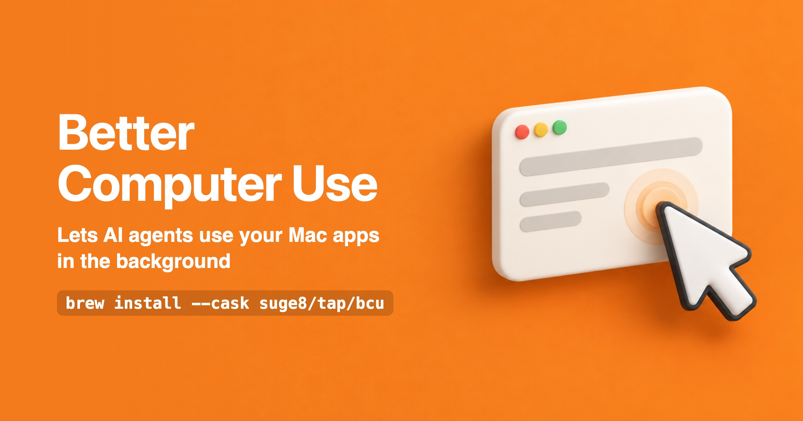

<p align="center"></p>

<p align="center"><a href="README.md">中文</a> · <b>English</b></p>

`bcu` is a command-line tool that lets an AI agent use the apps on your Mac: read what a window shows, press buttons, type, pick menu items, scroll. Whatever can happen in the background happens there, so you keep using your computer.

Any agent that can run shell commands can use it: Claude Code, Codex, Cursor, Pi. No MCP server to install.

## Install

```bash
brew install --cask suge8/tap/bcu
bcu setup
```

`bcu setup` walks you through turning on two permissions for `bcu.app` under System Settings → Privacy & Security: Accessibility and Screen Recording. `brew upgrade` keeps them.

Then give your agent the usage guide (a skill that teaches it bcu):

```bash
npx skills add Suge8/friedbun --skill better-computer-use
```

Now tell the agent what you want, for example "divide 86.4 by 4 in Calculator and write the result into TextEdit".

## In action

<p align="center"></p>

The orange arrow is the agent's cursor. It is only drawn on screen so you can follow along; your own pointer is not moved.

## What it does

**Works in the background.** Buttons, fields and menus go through the macOS accessibility API first, then key and mouse events sent straight to the target app, neither of which needs the window in front. It brings the app forward only when the background attempt provably did nothing or the control needs the foreground.

**Reads structure instead of pixels.** A window comes back as a list of elements such as "button Save" or "textfield Name", and the agent acts on them by ref. No screenshot by default, so the agent gets a short block of text.

**Handles apps without structure.** For WeChat, Qt apps and games, which expose almost nothing, bcu reads the text on screen (Chinese and English) so the agent can press it, and hands over a screenshot for clicking by coordinates when needed.

**Reports every step.** Each action returns what changed in the window and whether there is evidence that it worked. An action that provably did nothing fails with an error that tells the agent what to do next.

**Reaches windows on other Spaces and full-screen apps** without switching your screen to them.

Usage lives in the [skill](https://github.com/Suge8/friedbun/blob/main/skills/operations/better-computer-use/SKILL.md); `bcu <command> --help` lists each command's options.

## FAQ

**How is this different from screenshot-based computer use?** Screenshot tools capture the screen at every step, have the model read the image and move the real pointer. bcu reads the structure apps report about themselves, does most actions in the background, and only captures the screen when there is no structure to read.

**Does my screen content leave my Mac?** bcu itself makes no network connections. What it reads goes to your agent, and so to the model the agent uses. Screenshots are taken only when needed and kept locally in `~/Library/Caches/bcu/shots/`.

**Keep it out of the foreground entirely?** Put `{"headless": true}` in `~/.config/bcu/config.json`. Every action then stays in the background, and some will fail in apps that only react to real input. Other settings: [configuration](./docs/configuration.md) (Chinese).

**What about web pages?** Browser windows can be clicked and typed into like any window. DOM, network and console work belongs to [better-browser-use](https://github.com/Suge8/friedbun/tree/main/skills/operations/better-browser-use).

## Limits

- Needs macOS 14 or later.
- Some UI only reacts while its app is in front (WeChat's search results dropdown, for one). bcu cannot tell from outside, so the agent has to switch to foreground mode explicitly, which activates the app, takes the keyboard and moves the real pointer.
- Background clicks and typing use private macOS interfaces that a system update may break.
- While the screen is locked macOS stops reporting window contents and bcu finds nothing; it recovers on unlock.

When something is off, run `bcu doctor` first, then see [troubleshooting](./docs/troubleshooting.md) (Chinese).

## Build from source

Needs Swift 6.2 (Xcode or the Command Line Tools) and a Developer ID Application certificate in your keychain, because macOS keys the permissions to the signing identity. `scripts/install.sh` builds, signs and replaces `/Applications/bcu.app`; without the brew install, link the command yourself: `ln -s /Applications/bcu.app/Contents/MacOS/bcu ~/.local/bin/bcu`. Development notes: [AGENTS.md](./AGENTS.md); design: [architecture](./docs/architecture.md) (Chinese).

## License

MIT. The macOS engine comes from [injaneity/pi-computer-use](https://github.com/injaneity/pi-computer-use) (MIT); background input is ported from [trycua/cua](https://github.com/trycua/cua) (MIT).
