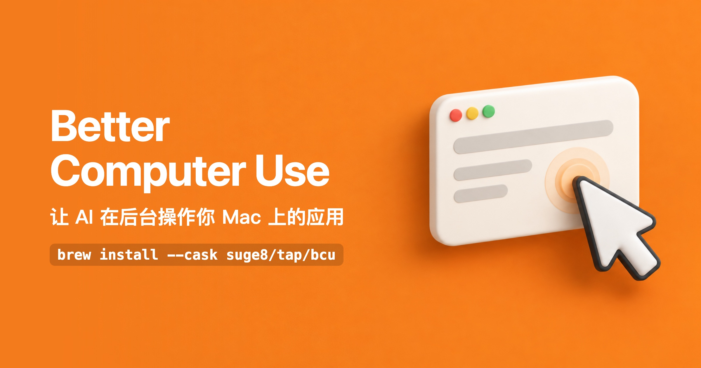
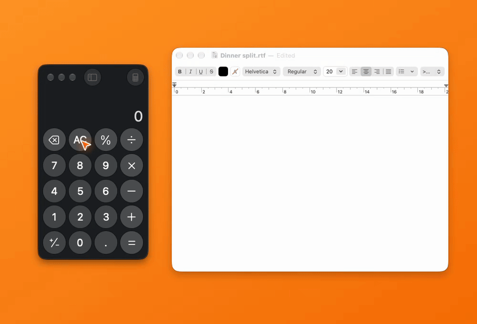

<p align="center"></p>

<p align="center"><b>中文</b> · <a href="README.en.md">English</a></p>

`bcu` 是一个命令行工具，让 AI agent 操作你 Mac 上的应用：读窗口里有什么，点按钮、打字、选菜单、滚动，能在后台做的就在后台做，你可以接着用自己的电脑。

只要 agent 能运行 shell 命令就能用，Claude Code、Codex、Cursor、Pi 都可以，不需要装 MCP 服务。

## 安装

```bash
brew install --cask suge8/tap/bcu
bcu setup
```

`bcu setup` 会带你在“系统设置 → 隐私与安全性”里给 `bcu.app` 打开两个权限：辅助功能、屏幕录制。之后 `brew upgrade` 不需要重新授权。

再给 agent 装上用法说明（一个 skill，教它怎么用 bcu）：

```bash
npx skills add Suge8/friedbun --skill better-computer-use
```

然后直接跟 agent 说要做什么，比如“用计算器算一下 86.4 除以 4，把结果写进文本编辑”。

## 实际效果

<p align="center"></p>

橙色箭头是 agent 的光标，只是画在屏幕上给你看的，你的鼠标不会被移走。

## 它能做什么

**在后台操作。** 按钮、输入框、菜单优先走系统的辅助功能接口，其次把键鼠事件直接发给目标应用，都不需要把窗口切到前面。只有后台确认没生效、或控件必须在前台操作时，才会切过去。

**读结构，不靠看图。** 窗口被读成一份元素列表，每一项是“按钮 保存”“输入框 名称”这样的文字，agent 照着编号去点。默认不截图，agent 收到的是一小段文字。

**自绘界面也能用。** 微信、Qt 程序、游戏这类读不到结构的窗口，bcu 会识别屏幕上的中英文文字，让 agent 按文字去点，必要时再看截图按坐标点。

**每一步都有结果。** 每个动作返回界面变了什么，以及有没有证据证明它生效。没生效就直接报错，并告诉 agent 下一步该怎么办。

**别的桌面空间、全屏应用里的窗口也能操作**，不会把你的屏幕切过去。

具体用法写在 [skill](https://github.com/Suge8/friedbun/blob/main/skills/operations/better-computer-use/SKILL.md) 里，每条命令的参数用 `bcu <命令> --help` 查看。

## 常见问题

**和截图式的 computer use 有什么不同？** 截图式方案每一步都要截屏、让模型认图、移动真实鼠标。bcu 读的是应用自己报告的界面结构，动作大多在后台完成，只在读不到结构时才截图识字。

**会把我的屏幕内容传到网上吗？** bcu 本身不联网。它读到的界面内容会交给你的 agent，也就是会发给 agent 所用的模型。截图只在需要时拍，存在本机的 `~/Library/Caches/bcu/shots/`。

**不想让它碰前台？** 在 `~/.config/bcu/config.json` 里写 `{"headless": true}`，所有动作只走后台，代价是有些应用的操作会失败。其它配置见 [配置](./docs/configuration.md)。

**网页呢？** 浏览器窗口可以像普通窗口一样点和输入。页面里的 DOM、网络请求、控制台交给 [better-browser-use](https://github.com/Suge8/friedbun/tree/main/skills/operations/better-browser-use)。

## 限制

- 需要 macOS 14 或更新版本。
- 有的界面只在应用处于前台时才有反应（例如微信搜索框的下拉结果）。bcu 从外面分不出来，agent 需要明确改用前台模式，这时会激活应用、占用键盘并移动真实鼠标。
- 后台点击和打字用到了 macOS 未公开的接口，系统升级后可能失效。
- 屏幕锁定时系统不再报告窗口内容，bcu 什么也找不到，解锁后恢复。

出问题先跑 `bcu doctor`，再看 [故障排查](./docs/troubleshooting.md)。

## 从源码构建

需要 Swift 6.2（Xcode 或 Command Line Tools）和钥匙串里的 Developer ID Application 证书（系统按签名身份记授权）。`scripts/install.sh` 构建、签名并替换 `/Applications/bcu.app`；没装 brew 版时自己链一个命令：`ln -s /Applications/bcu.app/Contents/MacOS/bcu ~/.local/bin/bcu`。开发说明见 [AGENTS.md](./AGENTS.md)，设计见 [架构](./docs/architecture.md)。

## License

MIT。macOS 引擎源自 [injaneity/pi-computer-use](https://github.com/injaneity/pi-computer-use)（MIT），后台输入移植自 [trycua/cua](https://github.com/trycua/cua)（MIT）。
